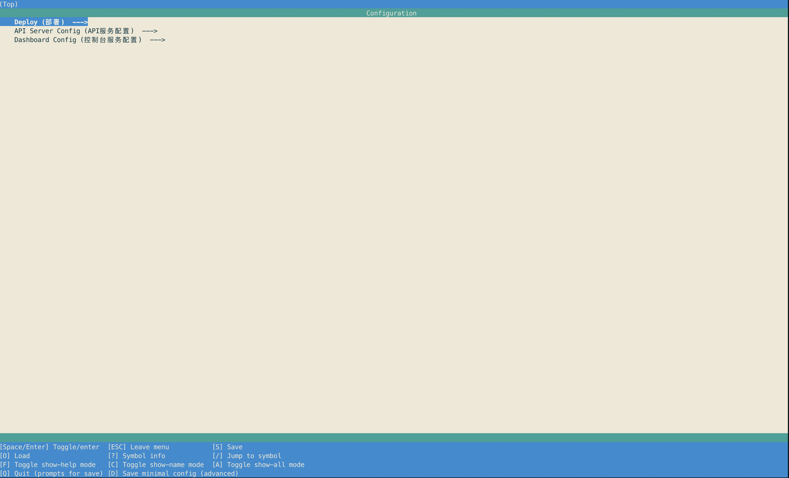

[](https://dev.azure.com/Hyperledger/Cello/_build/latest?definitionId=27&branchName=master)

Hyperledger Cello is a blockchain provision and operation system, which helps manage blockchain networks in an efficient way.

1. [Introduction](#introduction)
2. [Main Features](#main-features)
3. [Quick Start](#quick-start)
4. [Documentation](#documentation-getting-started-and-develop-guideline)
5. [Why named cello?](#why-named-cello)
6. [Notice](#incubation-notice)

## Introduction
Using Cello, everyone can easily:

* Build up a Blockchain as a Service (BaaS) platform quickly from scratch.
* Provision customizable Blockchains instantly, e.g., a Hyperledger fabric network v1.0.
* Maintain a pool of running blockchain networks on top of baremetals, Virtual Clouds (e.g., virtual machines, vsphere Clouds), Container clusters (e.g., Docker, Swarm, Kubernetes).
* Check the system status, adjust the chain numbers, scale resources... through dashboards.

A typical usage scenario is illustrated as:


## Quick Start

Environmental preparation:

1. docker [how install](https://get.docker.com)
2. docker-compose [how install](https://docs.docker.com/compose/install/)
3. make `all script for cello service management is written in Makefile`
4. kubernetes (`optional`) [how install](https://kubernetes.io/docs/setup/)
5. node [how install](https://nodejs.org/en/download/)

If environment is prepared, then we can start cello service.

* Build essential images for cello service (Optional, because currently the dockerhub image auto build haven't ready, in the future you can ignore this step.)
       
    * Build API Engine
       ```bash
       $ make api-engine
       ```
    * Build Docker Agent 
       ```bash
       $ make docker-rest-agent
       ```
    * Build Docker Dashboard
       ```bash
       $ make dashboard
       ```

<!---
* config variables for service deployment through menuconfig/alldefconfig, then will generate .config file under the project folder.

if you want to use default configuration for service deployment, only need run alldefconfig.

```bash
# make alldefconfig
```

if you want to set the config through terminal ui, run menuconfig .

```bash
# make menuconfig
```
-->

* Start cello service.<!---, default deployment method is using docker-compose, if you have kubernetes environment,-->
<!---you can change deployment method to kubernetes through `DEPLOY_METHOD=k8s make start`.-->
```bash
$ make start
```

After service started up, if use docker-compose method, you can see output:

```bash
CONTAINER ID   IMAGE                            COMMAND                  CREATED         STATUS         PORTS                                                                                  NAMES
81e6459965ec   hyperledger/cello-agent-docker   "gunicorn server:app…"   4 seconds ago   Up 2 seconds   0.0.0.0:2375->2375/tcp, :::2375->2375/tcp, 0.0.0.0:5001->5001/tcp, :::5001->5001/tcp   cello.docker.agent
04367ab6bd5e   postgres:11.1                    "docker-entrypoint.s…"   4 seconds ago   Up 2 seconds   0.0.0.0:5432->5432/tcp, :::5432->5432/tcp                                              cello-postgres
29b56a279893   hyperledger/cello-api-engine     "/bin/sh -c 'bash /e…"   4 seconds ago   Up 2 seconds   0.0.0.0:8080->8080/tcp, :::8080->8080/tcp                                              cello-api-engine
a272a06d8280   hyperledger/cello-dashboard      "bash -c 'nginx -g '…"   4 seconds ago   Up 2 seconds   80/tcp, 0.0.0.0:8081->8081/tcp, :::8081->8081/tcp                                      cello-dashboard
```
<!---
If use kubernetes method to deploy, the output is:

```bash
NAME                                     READY   UP-TO-DATE   AVAILABLE   AGE
deployment.extensions/api-engine         1/1     1            1           7s
deployment.extensions/api-engine-tasks   1/1     1            1           7s
deployment.extensions/postgres           1/1     1            1           8s
deployment.extensions/redis              1/1     1            1           8s

NAME                                    READY   STATUS    RESTARTS   AGE
pod/api-engine-5844d7d9d4-zqw9k         1/1     Running   0          7s
pod/api-engine-tasks-74484d6f45-jj6p9   1/1     Running   0          7s
pod/postgres-774d5cd5f-p5j5l            1/1     Running   0          8s
pod/redis-6bf574b8c5-p2dnl              1/1     Running   0          7s

NAME                                    HOSTS   ADDRESS   PORTS   AGE
ingress.extensions/ingress-api-engine   *                 80      7s
```
-->


* Stop cello service.<!---, same as start, need set the `DEPLOY_METHOD` variable.-->

```bash
$ make stop
```


## Main Features
* Manage the lifecycle of blockchains, e.g., create/start/stop/delete/keep health automatically.
* Support customized (e.g., size, consensus) blockchains request, currently we mainly support [Hyperledger fabric](https://github.com/hyperledger/fabric).
* Support native Docker host, swarm or Kubernetes as the worker nodes. More supports on the way.
* Support heterogeneous architecture, e.g., X86, POWER and Z, from bare-metal servers to virtual machines.
* Extend with monitor, log, health and analytics features by employing additional components.

## Documentation, Getting Started and Develop Guideline
For new users, it is highly recommended to read the [tutorial](docs/tutorial.md) or [index](docs/index.md) first.

And feel free to visit the [online documentation](http://cello.readthedocs.io/en/latest/) for more information. You can also run `make doc` to start a local documentation website (Listen at [localhost:8000](http://127.0.0.1:8000).

## Why named Cello?
Can you find anyone better at playing chains? :)

## Incubation Notice
This project is a Hyperledger project in _Incubation_. It was proposed to the community and documented [here](https://docs.google.com/document/d/1E2i5GRqWsIag7KTxjQ_jQdDiWcuikv3KqXeuw7NaceM/edit), and was approved by [Hyperledger TSC at 2017-01-07](https://lists.hyperledger.org/pipermail/hyperledger-tsc/2017-January/000535.html). Information on what _Incubation_ entails can be found in the [Hyperledger Project Lifecycle document](https://goo.gl/4edNRc).

<a rel="license" href="http://creativecommons.org/licenses/by/4.0/"></a><br />This work is licensed under a <a rel="license" href="http://creativecommons.org/licenses/by/4.0/">Creative Commons Attribution 4.0 International License</a>.
