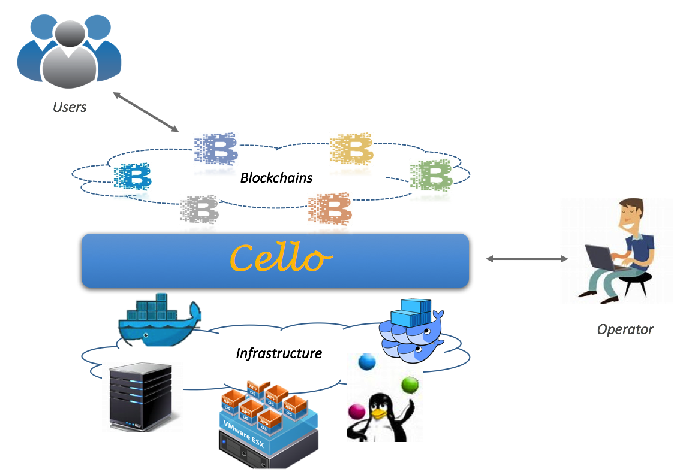

Platform to provide Blockchain as a Service!

Using Cello, we can 

* Provision customizable Blockchains instantly, e.g., a 6-node chain using PBFT consensus.
* Maintain a pool of running blockchains healthy with no manual operations. 
* Check the system status, scale the chain numbers, change resources... through a dashboard.

You can also find more [scenarios](docs/scenario.md).

## Features

* Manage the lifecycle of blockchains, e.g., create/delete/keep health automatically.
* Response nearly instantly, even with hundreds of chains, or nodes.
* Support customized (e.g., size, consensus) blockchains request, currently we support [hyperledger fabric](https://github.com/hyperledger/fabric).
* Support native Docker host or swarm host as the compute nodes, more supports on the way.
* Support heterogeneous architecture, e.g., Z, Power and X86, from bare-metal servers to virtual machines.
* Extend with monitor/log/health features by employing additional components.

## Docs

### User Docs
* [Dashboard](docs/dashboard.md)

### Operator Docs
* [Installation & Deployment](docs/deployment.md)
* [Scenarios](docs/scenario.md)
* [Production Configuration](docs/production_config.md)

### Development Docs
* [Architecture Design](docs/arch.md)
* [Database Model](docs/db.md)
* [API](api/restserver_v2.md)

## TODO
* restserver: update api definitions yml files.
* dashboard: support auto state fresh based on websocket.
* dashboard: support return code checking in response.
* dashboard: support user page.
* engine: support advanced scheduling.
* engine: support more-efficient fill-up.
* engine: enhance the robustness for chain operations.
* engine: support membersrvc option.

## Why named Cello?
Can u find anyone better at playing chains? :)

## Author
Designed and maintained by [Baohua Yang](https://yeasy.github.com).
