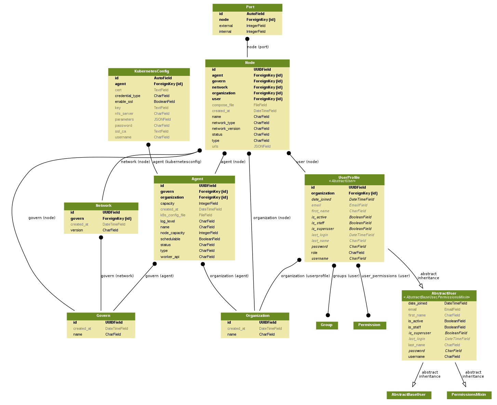
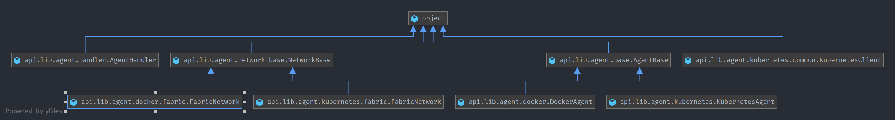

# Source Code

## Code Structure

```shell
├── api
│   ├── __init__.py
│   ├── admin.py
│   ├── apps.py
│   ├── auth.py # code related to authentication
│   ├── common
│   │   ├── __init__.py
│   │   ├── enums.py
│   │   └── serializers.py
│   ├── exceptions.py # all defined exceptions
│   ├── lib
│   │   ├── __init__.py
│   │   └── agent # all code for agent implementation
│   ├── management # command lines for django app
│   │   ├── __init__.py
│   │   └── commands
│   ├── migrations
│   │   └── __init__.py
│   ├── models.py # data models definition
│   ├── routes # all api implemented code
│   │   ├── __init__.py
│   │   ├── agent
│   │   ├── cluster
│   │   ├── network
│   │   ├── node
│   │   ├── organization
│   │   └── user
│   ├── tasks # Code for all asynchronous task implementations
│   │   ├── __init__.py
│   │   └── agent.py
│   ├── tests.py
│   ├── utils
│   │   ├── __init__.py
│   │   ├── common.py
│   │   └── port_picker.py
│   └── views.py
├── api_engine # Project config
│   ├── __init__.py
│   ├── celery.py
│   ├── settings.py.example
│   ├── settings.py.initial
│   ├── urls.py
│   └── wsgi.py
├── manage.py
├── requirements.txt
└── tox.ini
```

## Data Model


## Agent Class Relation

