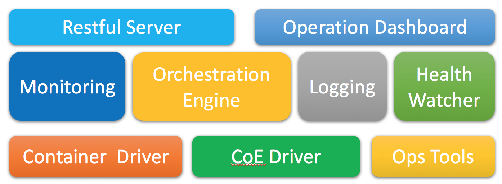

# Architecture Design

Here we discuss the architecture design for the mangement services on the Master node.

## Philosophy and principles
The architecture will follow the following principles:

* Micro-service: Means we decouple various functions to individual micro services. No service will crash others whatever it does.
* Fault-resilience: Means the service should be tolerant for fault, such as database crash.
* Scalability: Try best to distribute the services, to mitigate centralized bottle neck.

## Functional Layers

Following the decouple design, there are 3 layers in Cello.

* Access layer: including those Web UI dashboards operated by users.
* Orchestration layer: received the request form Access layer, and make call to correct agents to operate the blockchain resources.
* Agent layer: real workers that interact with underly infrastructures like Docker, Swarm, K8s.

Each layer should maintain stable APIs for upper layers, to achieve pluggability without changing upper layer code.

### Agent layer APIs

* Host management: create, query/list, update, delete, fillup, clean, reset
* Cluster management: create, query/list, start/stop/restart, delete, reset

## Components

* `operator dashboard`: Provide the dashboard for the pool administrator, also the core engine to automatically maintain everything.
* `engine`: Provide the restful api for other system to apply/release/list chains.
* `watchdog`: Timely checking system status, keep everything healthy and clean.

## Implementation

The restful server's implementation is based on [Django](https://www.djangoproject.com/), which is a mature framework for web services.

 This work is licensed under a <a rel="license" href="http://creativecommons.org/licenses/by/4.0/">Creative Commons Attribution 4.0 International License</a>.
