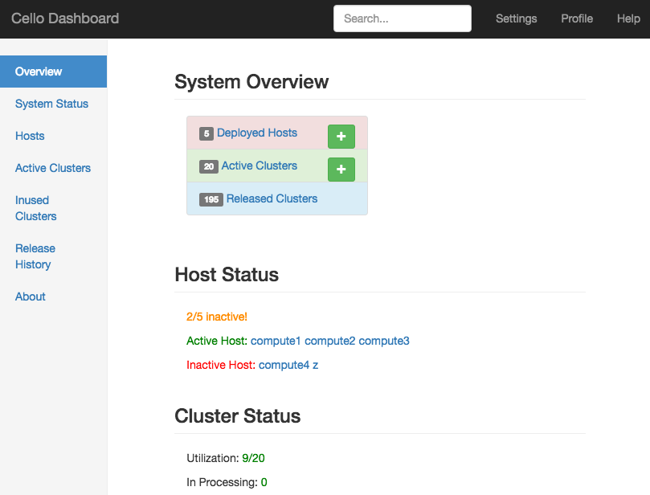
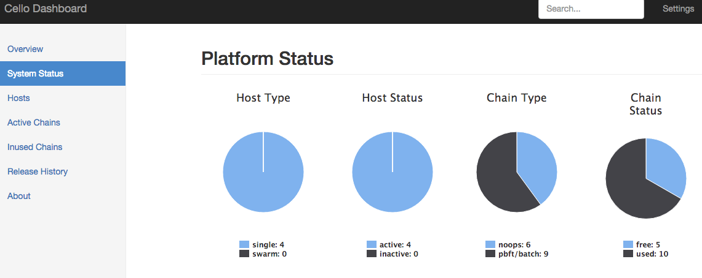
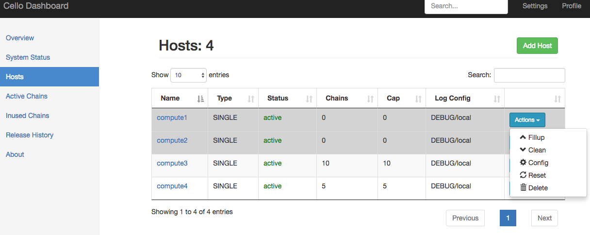
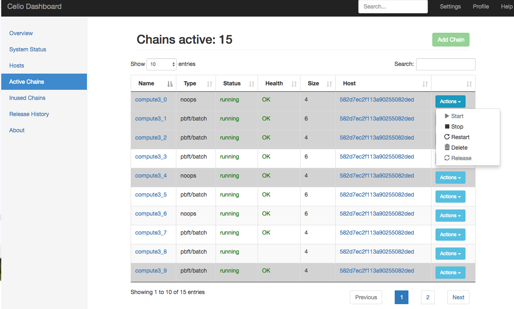
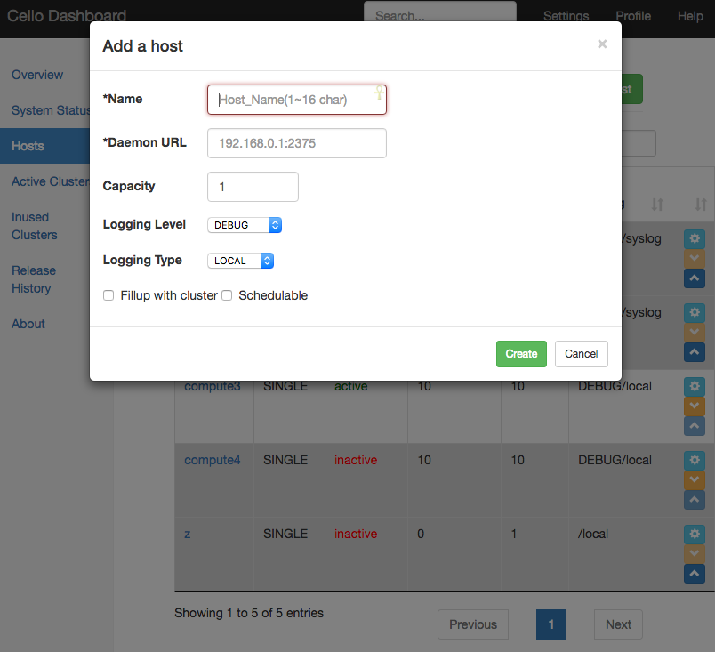
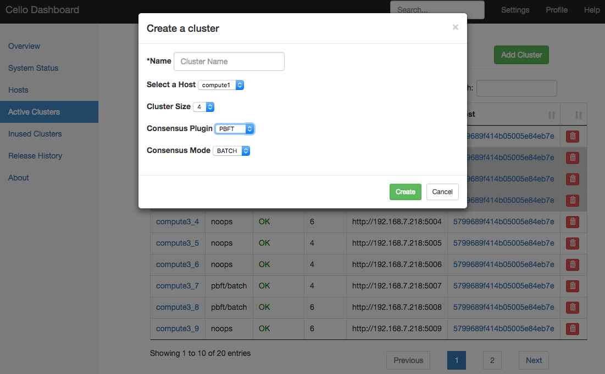

# Dashboard

System operators can utilize dashboard service to check system status or change configurations.

The dashboard service will listen on port `8080`.

## Overview

URL: `/index`.

See a high-level overview on system status.

## System Status

URL: `/stat`.

See statistics on the system.

## Hosts

URL: `/hosts`.

Operate on the hosts managed by the system.

## Clusters_active

URL: `/clusters?type=active`.

Operate on existing running chains in the pool.

## Clusters_inused

URL: `/clusters?type=inused`.

Operate on user occupied chains in the system.

## Clusters_released

URL: `/clusters?type=released`.

See cluster releasing history data.

## Screenshots

