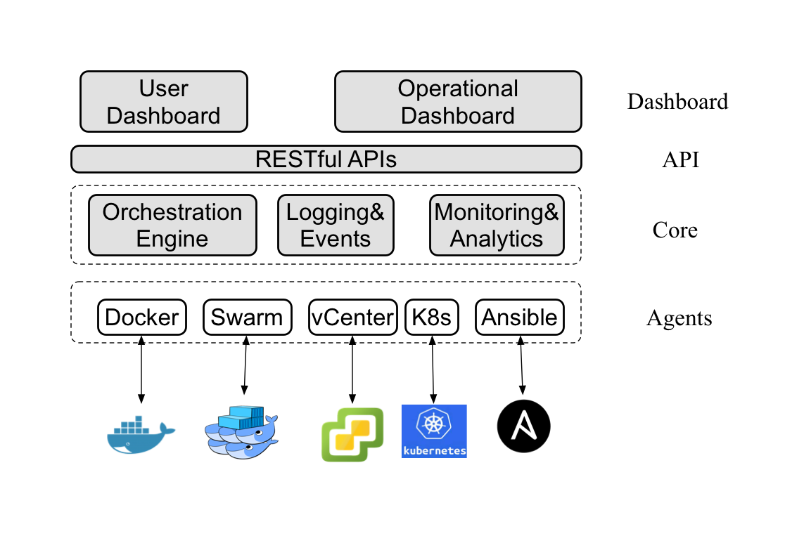

# Installation

*Here we describe the setups for development usage. If you want to deploy Cello for production, please also refer to the [Production Configuration](production_config.md).*

Cello follows a typical Master-Worker architecture. Hence there will be two types of Nodes.

* Master Node: Manage (e.g., create/delete) the chains inside Work Nodes, with Web dashboard listening on port `8080` and RESTful api on port `80`;
* Worker Node: Chain providers, now support Docker Host or Swarm Cluster. The Docker service should be accessible from port `2375` from the Master Node.

For each Node, it is suggested as a Linux-based (e.g., Ubuntu 14.04+) server/vm:

## Worker Node

Currently we support Docker Host or Swarm Cluster as Worker Node. More types will be added soon.

`Docker Host`: See [Installation on Worker Docker Node](installation_worker_docker.md).
`Docker Swarm `: TODO.
`Kubernetes`: TODO.
`vSphere`: TODO.

## Master Node

See [Installation on Master Node](installation_master.md).

### Make Command

A Makefile is provided to help setup the master node, please refer [make_support](/make_support.md) page.

*Licensed under Creative Commons Attribution 4.0 International License
   https://creativecommons.org/licenses/by/4.0/*

 This work is licensed under a <a rel="license" href="http://creativecommons.org/licenses/by/4.0/">Creative Commons Attribution 4.0 International License</a>.
