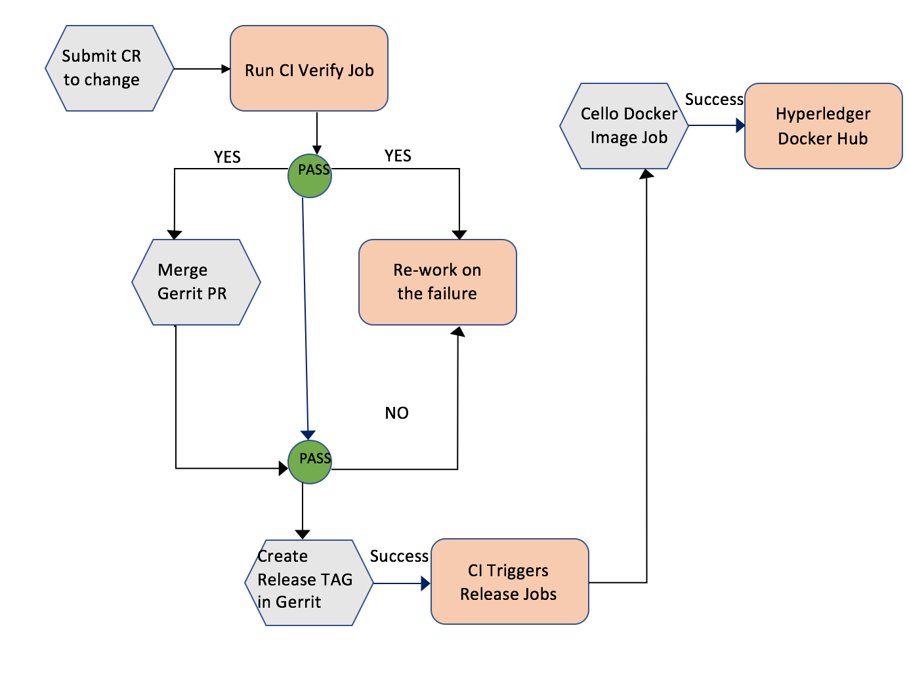

# Release Process Document

Below is the detailed plan on the Hyperledger Cello Release process, namely the steps taken to
publish docker images.

On the release day a maintainer submits a patch set to the hyperledger/cello repository to trigger
the release process by changing the following variables in the Makefile - ``IS_RELEASE = TRUE``,
``BASE_VERSION`` and ``PREVIOUS_VERSION`` - to the appropriate versions.

CI triggers the cello-verify-x86_64 jobs and returns **SUCCESS (+1)**
or **FAILURE (-1)** results (gerrit voting) back to the gerrit patch set commit. After approving
the successful patch, maintainers merge the patch.

Upon notification of the successful merge, the Release Engineer creates a "Release Tag" in the
hyperledger/cello repository which in turn kicks off the Build Process and CI (Jenkins) triggers
release jobs (listed below) based on the newly created "Release Tag".

**Release Process from CI**:

As part of the release process, CI automatically triggers the following release jobs after a
"Release Tag" is created in each repository:

- **Publish Fabric Docker images**:

CI triggers release jobs on two platforms (**s390x and ppc64le**) and for **x86_64** configured to be
auto published from dockerhub auto-build, upon successful run, publishes Docker images (*cello-mongo, cello-nginx, cello-baseimage*) to the
[(https://hub.docker.com/u/hyperledger/)](https://hub.docker.com/u/hyperledger/ "Hyperledger Docker Hub") account.

- cello-release-ppc64le
- cello-release-s390x

What happens?:

- Release job executes `make docker` and builds docker images. The job then calls `make install`
which in-turn will publish the docker images to the Hyperledger Docker Hub account.

- Each image is then tagged as follows:

     hyperledger/componentname:ARCH_Name-BASE_VERSION ex: (hyperledger/cello-baseimage:ppc64le-v0.8.0-alpha)
