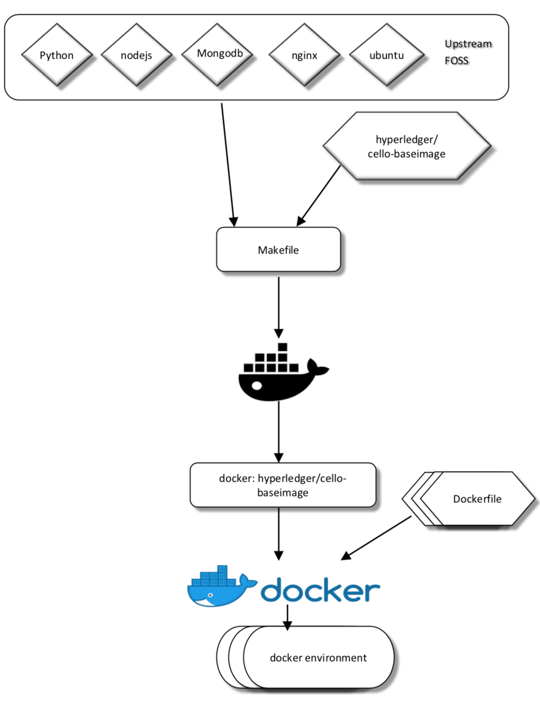

## Master Node Setup
The [Master Node](./terminology.md) includes several services:

* `operator dashboard`: Provide Web UI for operators.
* `engine`: Provide RESTful APIs for chain consumers.
* `watchdog`: Watch for health checking.

*More details can be found at the [Architecture Design](./arch.md).*

### System Requirement

* Hardware: 8c16g100g
* Docker engine: 1.10.0~1.13.0 (Docker 17.0+ support is experimental)
* docker-compose: 1.8.0~1.12.0

The [Master Node](./terminology.md) can be deployed by in 2 steps.

* Clone code
* Run setup script

### Clone Code

You may check `git` and `make` are installed to clone the code.

```sh
$ sudo aptitude install git make -y
$ git clone http://gerrit.hyperledger.org/r/cello && cd cello
```

### Run Setup

For the first time running, please setup the master node with the [setup.sh](https://github.com/hyperledger/cello/blob/master/scripts/master_node/setup.sh).

Just run (safe to repeat it):

```sh
$ make setup-master
```

Make sure there is no error during the setup. Otherwise, please check the log msgs with `make logs`.

### Usage

#### Start/Stop/Restart
To start the whole services, please run

```sh
$ make start
```

To stop or restart the whole services, run `make stop` or `make restart`.

#### Redeploy a service
To redeploy one specific service, e.g., dashboard, please run

```sh
$ make redeploy service=dashboard
```

#### Check Logs
To check the logs for all the services, please run

```sh
$ make logs
```

To check the logs for one specific service, please run
```sh
$ make log service=watchdog
```

Now you can access the `MASTER_NODE_IP:8080` to open the Web-based [operation dashboard](./dashboard_operator.md).

### Configuration
The application configuration can be imported from file named `CELLO_CONFIG_FILE`.

By default, it also loads the `config.py` file as the configurations.

### Data Storage
The mongo container will use local `/opt/cello/mongo` path (Must exist locally) for persistent storage.

Please keep it safe by backups or using more high-available solutions.

### Work with MacOS

In MacOS, Docker cannot mount local path from host by default. Hence for mongo container data volume, users need to:

* Make sure the `/opt/cello` path exists locally, and it is writable for the current user account. Simply just run `make setup-master`.
* Add the path to `File Sharing` list in the preference of [Docker for MacOS](https://docs.docker.com/docker-for-mac/install/), to make it mountable by container.

## More Commands using make

To know more what the following make commands does please refer [make_support](./make_support.md) page.

## Cello Docker Images

Cello project also provide Docker images for quick adoptions, users can pull these images from dockerhub or build locally.



### Pull from Dockerhub
The build process is generally expensive so you may wanna just pull those images from Dockerhub.

Run `cd scripts/master_node && bash download_images.sh` will pull the following images:

* [hyperledger/cello-baseimage](https://hub.docker.com/r/hyperledger/cello-baseimage/): Base images for the service images.
* [hyperledger/cello-engine](https://hub.docker.com/r/hyperledger/cello-engine/): Docker images for the engine service.
* [hyperledger/cello-mongo](https://hub.docker.com/r/hyperledger/cello-mongo/): Docker images for the Mongo DB service.
* [hyperledger/cello-nginx](https://hub.docker.com/r/hyperledger/cello-nginx/): Docker images for the Nginx service.
* [hyperledger/cello-operator-dashboard](https://hub.docker.com/r/hyperledger/cello-operator-dashboard/): Docker images for the Operator Dashboard service.
* [hyperledger/cello-user-dashboard](https://hub.docker.com/r/hyperledger/cello-user-dashboard/): Docker images for the User Dashboard service.

By default, the `laetst` version of images will be pulled, and you may optionally specify the version of images to pull down:

```
$ cd scripts/master_node
$ VERSION=0.8.0-beta bash download_images.sh
```

### Local Building
Run `make docker` will build the docker images locally and commit with architecture and version tag; e.g. "hyperledger/cello-baseimage:x86_64-0.8.0-snapshot-7b7fab6".

<a rel="license" href="http://creativecommons.org/licenses/by/4.0/"></a><br />This work is licensed under a <a rel="license" href="http://creativecommons.org/licenses/by/4.0/">Creative Commons Attribution 4.0 International License</a>.
