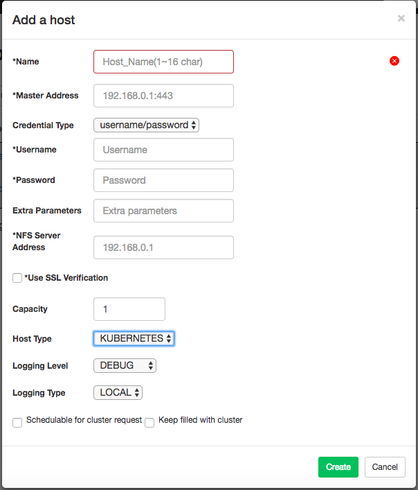
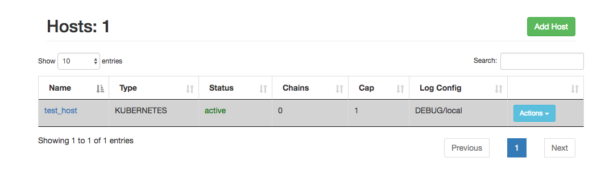

# Kubernetes type host creation guide

TLDR: setup a miniKube env: `WORKDER_TYPE=k8s  MASTER_NODE=x.x.x.x make setup-worker`.

## Prepare Kubernetes environment

1. Get started with Kubernetes: [Kubernetes Guide](https://kubernetes.io/docs/user-journeys/users/application-developer/foundational/)

2. Run `bash cello/scripts/setup_k8s_worker.sh` to set up a Minikube as test environment, the script requires root authority to run.

## Add Kubernetes type host

Login to Cello and navigate to the Hosts->;Add Host

In the "Add a host" page select "Host Type" as KUBERNETES

 

Give a name of the Kubernetes host like "cello-k8s", you can specify a capacity number, this number can be configured later.

 

In the Master address field input your Kubernetes master node IP address. Port 443 is used as default and is only supported for now.

In the "Credential Type" drop down list, select the credential type for Kubernetes host.

In the "NFS Server Address" input the NFS server address.

**Action required for NFS Service:**
Cello provides the NFS server by default, please ensure the kubernete cluster could connect to the Cello Host node.

Use the host node IP as the NFS address.

In the "Use SSL Verification" checkbox, check it if SSL verification is enabled.

Optional: in the "Extra Parameters" input the extra Kubernetes parameters in JSON format.

There are three ways to connect to Kubernetes Host:
#### Username & password

In the "username" and "password" fields input the username & password with the correct privileges.

#### Certificate and key

In the "Certificate content" input ssh certificate content.

In the "Key content" input ssh key content.

#### Configuration file

In the "Configuration content" input configuration file content.

### Finish Creating Host

Click Create. You will see the follow page.

 

This means that the Kubernetes host is ready the new host will be in active state.

