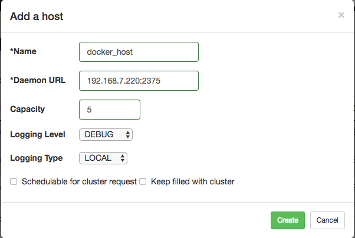
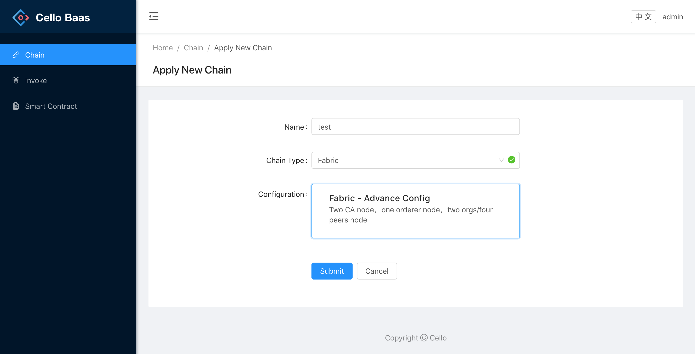
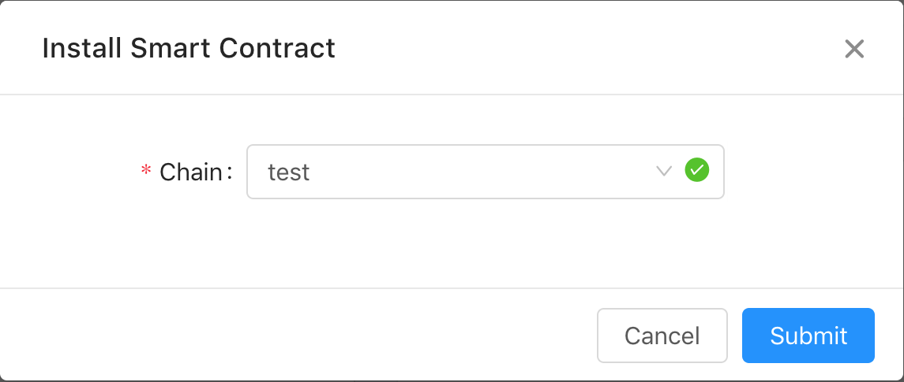
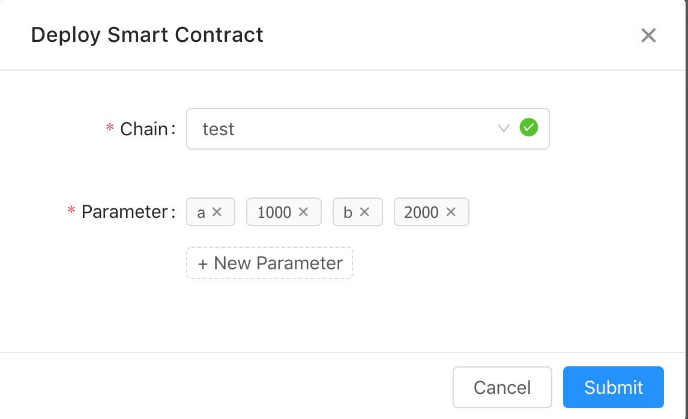
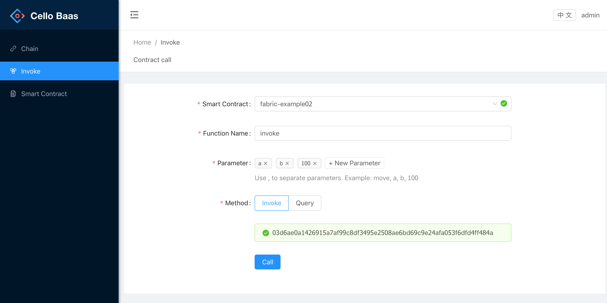
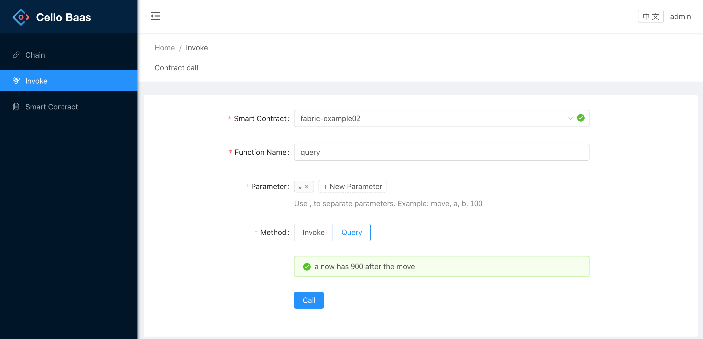

# Tutorial

## Basic Concepts

Have a look at the [terminology](terminology.md) to understand the basic concepts first.

## Setup Cello

Following the [setup guideline](setup/setup.md) to start Cello.

After that, operators can interact with Cello through the [operator dashboard](http://localhost:8080).

By default, the operator dashboard will listen on port `8080` at the Master Node, with default administrator account of `admin:pass`.

## Add a Host

The first time to open the operator dashboard, there will be no hosts. There are two methods to add more hosts into the pool.

* Through the `Overview` page: Click the `+` button after the `Working Hosts`;
* Through the `Hosts` page: Click the `Add Host` button at the top right corner.

Then you will see a jumped-out dialog to input the setup info according to the chosen type.

Suppose to import a native Docker server, you may need to input those fields

* Name: docker_host
* Daemon URL: `192.168.7.220:2375` (replace this with your docker host address)
* Capacity (Maximum number of chains on that host): 5
* Logging Level: Default is DEBUG, you can change to `INFO`, `NOTICE`,`WARNING`,`ERROR`,`CRITICAL`
* Logging Type: Default is LOCAL
* Schedulable for cluster request: True or False. If click to set True, it will schedule a chain request to that host, useful when maintain the host
* Keep filled with cluster: True or False. If click to set True, it will autofill the host server to its capacity with chains.

After successful adding, you can find the `docker_host` shown in the Host page, with 0 chains and Cap is 5.

If you are going to create vSphere type host, you can take the steps at the [vSphere type host creation guide](setup/setup_worker_vsphere.md).

If you are going to create Kubernetes type host, you can take the steps at the [Kubernetes type host creation guide](setup/setup_worker_kubernetes.md).

## Create a Chain

Now we have the free host in the pool, new chains can be create.

Open the Active Chain page, it should be empty now, click the `Add Chain` button on the top right corner, input those fields:

* Name: test_chain

And select the host with the `docker_host`.

Click the create button to add a new chain with name `test_chain` into the pool.

Then you can see it at the Active Chain page.

## Enable auto-mode

It will be difficult if you have a numbers of chains to create manually. Cello provides automated ways to save time.

* Use the host action dropdown menu: The Fillup button will fill the host full with chains until its at capacity, while the Clean button will clean all unused chains from the host.
* Use the Autofill checkbox: In the host configuration, you can find a `Keep filled with cluster` checkbox, which will automatically watch the host and keep it full with chains to the capacity.

Try these methods as you like.

## Apply a blockchain

By default, the user dashboard will listen on port `8081` at the Master Node, and operators can login in with default `admin:pass` credential. Or you can change to "sign up" to create a new account.

Click "Apply Now" to apply a new blockchain. Fill the "Name" field as the chain name, and select "Fabric" for the chain type. Then there will show one Fabric - Advance Config for configurations, keep selecting as default configuration, then click Submit button to request a new blockchain.

## Add a Smart Contract

By default, there are two smart contracts examples available. You can add a new smart contract by uploading your local smart contracts file.

[map example](https://github.com/hyperledger/cello/blob/master/user-dashboard/src/config-template/cc_code/examples/fabric/map/map.go)

This chaincode implements a simple map that is stored in the state.

The following invoke functions are available.

* put - requires two arguments, a key and value, and stores them in the state
* remove - requires a key and removes it from the state
* get - requires one argument, a key, and returns a value
* keys - requires no arguments, returns all keys

One query function:
* query - requires one argument, a key, and returns a value

[fabric-example02 example](https://github.com/hyperledger/cello/blob/master/user-dashboard/src/config-template/cc_code/examples/fabric/chaincode_example02/chaincode_example02.go)

In this example, we use Init to configure the initial state of variables on the ledger. The example accepts 4 parameters as input and writes validated values on ledger.

* First account name
* Initial amount (integer) in first account
* Second account name
* Initial amount (integer) in second account

The following operations are available.

* Invoke - requires two arguments, a key and value, and stores them in the state
* Query - requires a key and removes it from the state

## Install/Deploy a Smart Contract

Click "..." of "fabric-chaincode_example02" smart contract, and select "Install". In the popup window select your chain where you want to install the smart contract.

After the smart contract installed, click "Instantiate" to deploy the smart contract. In the popup window select your chain where you want to initiate the smart contract. and click "New Parameter" to add four parameters, for example: "a", "1000", "b", "2000".

## Invoke/Query a Smart Contract

In the 'Invoke' page, you can perform the contract call as the following.

* Smart Contrac: `fabric-example02`
* Function Name: `invoke`
* Parameters: `a`, `b`, `100`
* Method: `Invoke`

Then we query the current value of `a`, which should be 900 now

## Dashboard for operator

If you want to know more advanced operational skills, please continue to the [Operator Dashboard](dashboard_operator.md).

## Dashboard for user

If you want to know more usage of chains and smart contracts, please continue to the [User Dashboard](dashboard_user.md).

 This work is licensed under a <a rel="license" href="http://creativecommons.org/licenses/by/4.0/">Creative Commons Attribution 4.0 International License</a>.
