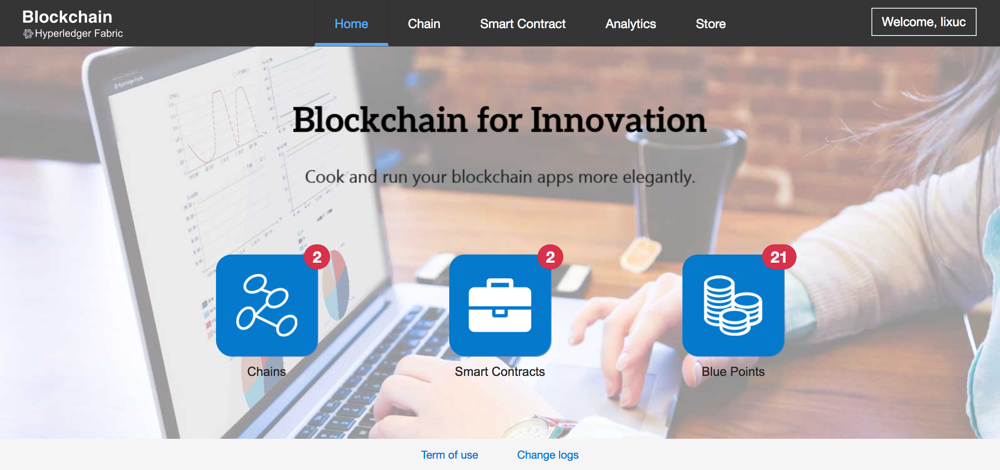

# User Dashboard for Blockchain

This dashboard is a web based application for blockchain developers. It is especially useful for blockchain apps incubation. You can upload your smart contract, apply one or more chains that deploy your smart contract, and invoke / query your smart contract functions on the dashboard. It include blockchain topology overview, network latency monitor and log tracking, blocks' transactions reveal and etc. Also support chaincode, fabric and infrastructure analytics.



## Installation

1. Goto directory of user dashboard

	```
	$ cd my-local-cello-dir/user-dashboard
	```

2. Build dashboard image

	```
	$ docker-compose build
	```

3. Start dashboard

	```
	$ docker-compose up -d
	```

4. Access url:  [http://localhost:8080](http://localhost:8080)

## Functions

| Name | URL | Description |
| --- | --- | --- |
| Home | `/dashboard` | The dashboard overview |
| Chain Management | `/dashboard/chain` | Include functions of apply / edit / release / start / stop / restart chains |
| Chain Detail | `/dashboard/chain/{id}` | Include functions of topology overview, log tracking, blocks view, APIs exposure and chaincode list / invoke / query |
| Smart Contract Management | `/dashboard/contract` | Include functions of smart contract upload, edit, delete and deploy |
| Analytics Overview | `/dashboard/analytics` | The high-level overview of chain status |
| Chaincode Analytics | `/dashboard/analytics/chaincode` | Chaincode invoke functions and response time statistic analysis |
| Fabric Analytics | `/dashboard/analytics/fabric` | Blocks amount and block time statistic analysis |
| Infrastructure Analytics | `/dashboard/analytics/infrastructure` | Cluster's CPU, memory, disk and network statistic analysis |

## License <a name="license"></a>.
The Hyperledger Cello project uses the [Apache License Version 2.0](LICENSE) software license.

